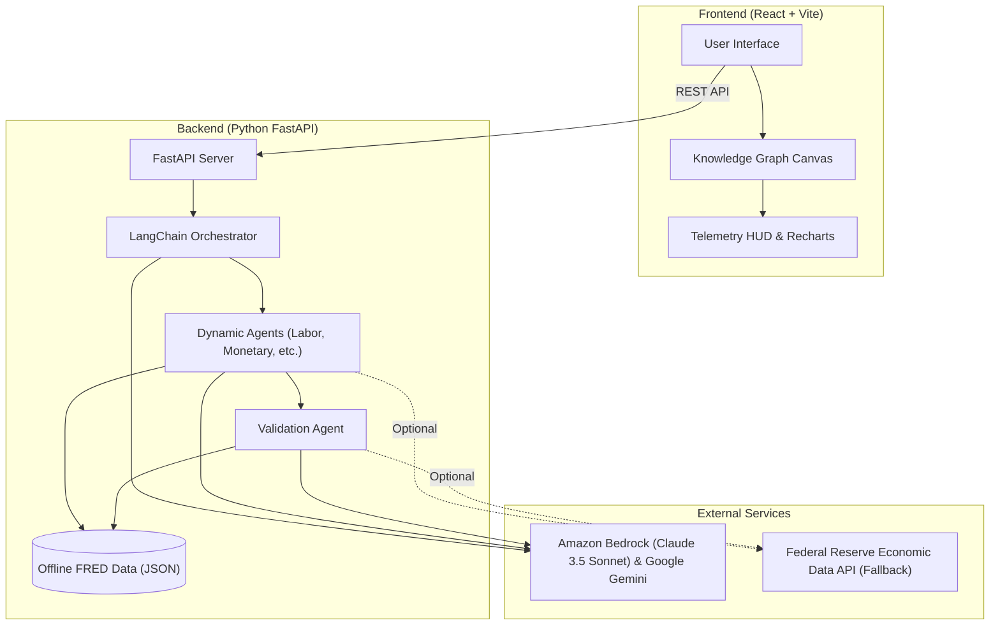

# FRED Intelligence Knowledge Graph

An AI-powered orchestration engine and interactive visualization platform designed to dynamically traverse, synthesize, and visualize macroeconomic relationships using data from the Federal Reserve Economic Data (FRED) API.

## Features

- **Interactive Knowledge Graph:** A responsive, physics-based D3 force-directed graph (`react-force-graph-2d`) that visualizes complex economic relationships in real-time.
- **Enterprise Telemetry HUD:** A sleek, glassmorphism-styled Heads-Up Display that provides deep-dive analytics on selected economic nodes, featuring auto-scaling historical sparklines powered by Recharts.
- **Multi-Agent Orchestration:** Driven by a Python backend using LangChain and Google's Gemini models. Dynamically named specialized agents (Labor, Monetary, Market, Validation, etc.) autonomously fetch and synthesize data to build the graph.
- **Zero-State Onboarding:** A polished, fully responsive onboarding flow that presents users with clickable "prompt cards" to execute complex economic queries with a single click.

## Architecture



## Tech Stack

**Frontend:**
- React (Vite)
- `react-force-graph-2d` for D3 graph rendering
- `recharts` for KPI sparkline generation
- Lucide React for iconography
- Vanilla CSS with modern Glassmorphism aesthetics

**Backend:**
- Python (FastAPI)
- LangChain, `langchain-aws` (Amazon Bedrock), & `langchain-google-genai`
- Offline FRED Data Processing & FRED API Integration
- `uv` for lightning-fast dependency management
- Uvicorn

## Getting Started: Comprehensive Setup Guide

Follow these step-by-step instructions to get the application running from scratch on a fresh machine (such as an AWS Workspace).

### Step 1: Clone the Repository
First, clone the repository to your local machine and navigate into the project directory:
```bash
git clone https://github.com/YOUR_USERNAME/fred-knowledge-graph.git
cd fred-knowledge-graph
```

### Step 2: System Prerequisites
Ensure you have the following installed on your machine:
- **Python 3.9+**
- **uv** (Required for lightning-fast Python dependency management)
- **Node.js (v18+)** and `npm` (Required for the frontend)

### Step 3: Configure Environment Variables
You must provide your LLM API keys for the backend orchestration engine. (The FRED data uses offline caching by default).

1. Locate the `.env_default` file in the root directory.
2. Create a copy of it and name it exactly `.env`.
3. Open `.env` and paste your actual API keys:
```env
# Required for Claude via AWS Bedrock
AWS_ACCESS_KEY_ID=...
AWS_SECRET_ACCESS_KEY=...
AWS_DEFAULT_REGION=...

# Or required for Google Gemini
GEMINI_API_KEY=your_actual_gemini_api_key_here

# Optional (only needed if falling back from offline data)
FRED_API_KEY=your_actual_fred_api_key_here
```
*(Note: `.env` is ignored by git so your secrets will not be accidentally pushed to GitHub).*

### Step 4: Backend Setup (Python)
Open a terminal in the root of the project to set up the backend.

1. **Install dependencies and start the FastAPI server:**
Using the modern `uv` package manager, you can run the server directly (it will automatically handle your virtual environment):
```bash
uv run python backend/server.py
```
*(The backend API will now be running on `http://0.0.0.0:8001`)*

### Step 5: Frontend Setup (React)
Open a **second, separate terminal window** in the root of the project.

1. **Install Node dependencies:**
```bash
npm install
```
2. **Start the Vite development server:**
```bash
npm run dev
```

### Step 6: Launch the App
Open your web browser and navigate to the local URL provided by the Vite server (typically `http://localhost:5173`). 

You will be greeted by the Zero-State Onboarding overlay. Click on any of the suggested prompt cards to automatically dispatch the AI agents and watch the knowledge graph build itself in real-time!
